 

`swe` &nbsp;//&nbsp; `rust + typescript` &nbsp;//&nbsp; `systems → product`

 

### tools

  
  
  
  
  
  
  
  

### open source

### stats

### contributions

<picture>
  <source media="(prefers-color-scheme: dark)" srcset="https://raw.githubusercontent.com/KBLCode/KBLCode/output/github-snake-dark.svg" />
  <source media="(prefers-color-scheme: light)" srcset="https://raw.githubusercontent.com/KBLCode/KBLCode/output/github-snake.svg" />
  
</picture>

 

`built in the open`
