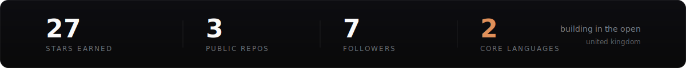
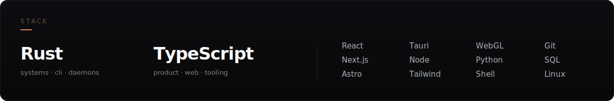
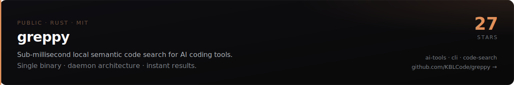

 

 
 

### stack

 

### open source

 
 

### how i work

> **fast is a feature.** &nbsp;no spinners, no waiting. latency is a design constraint, not an afterthought.
>
> **metal to ui.** &nbsp;systems in rust, products in typescript — the whole stack, end to end.
>
> **tools that get used.** &nbsp;ship the thing people reach for daily, not the demo.

 

### contributions

<picture>
  <source media="(prefers-color-scheme: dark)" srcset="https://raw.githubusercontent.com/KBLCode/KBLCode/output/github-snake-dark.svg" />
  <source media="(prefers-color-scheme: light)" srcset="https://raw.githubusercontent.com/KBLCode/KBLCode/output/github-snake.svg" />
  
</picture>

 

  <code>built in the open</code> &nbsp;·&nbsp; <a href="https://kblcode.github.io">kblcode.github.io</a>

